@title[Title]

## Durable Functions
# Complexity behind Simplicity

---
@title[Serverless refresher]

## What is serverless?
- Abstraction of servers
- Event-driven
- Micro-billing
---
@title[Azure functions]


---
<!-- .slide: data-transition="none" -->

@title[What is still hard?]

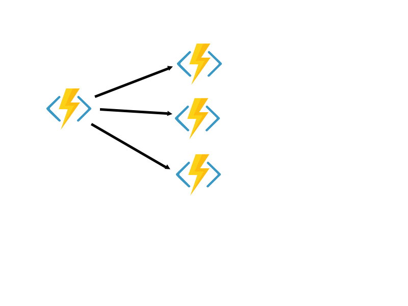


---
<!-- .slide: data-transition="none" -->

@title[What is still hard?]


---
<!-- .slide: data-transition="none" -->

@title[What is still hard?]

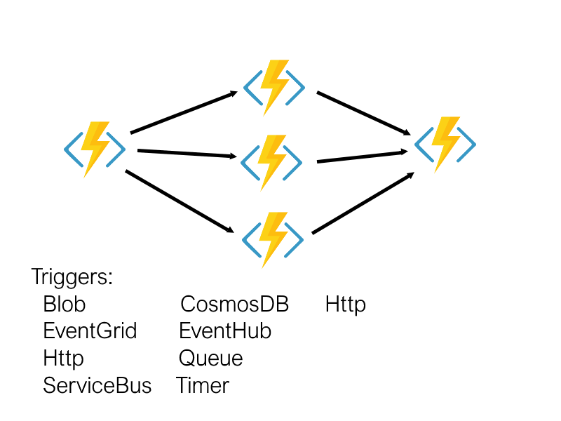

---
<!-- .slide: data-transition="none" -->

@title[What is still hard?]


---
@title[Overhead]


---
@title[Durable functions intro]

## Durable Functions
- Simplify orchestration <!-- .element: class="fragment" -->
- Code your workflow  <!-- .element: class="fragment" -->
- 100% reliability  <!-- .element: class="fragment" -->

---
<!-- .slide: data-transition="none" -->

@title[New triggers]


Note:
Now we get two new triggers:
- Orchestration trigger and
- Activity trigger

We will name all these functions now Activities and they are got triggered by the activity triggers.

And next to them we add another function

---
<!-- .slide: data-transition="none" -->

@title[New triggers]


Note:
That is called Orchestrator. Orchestrator basically fires acrivity events in programmed order with required parameters and collects the results.


Let's jump into code and see how cool durable functoins are.

---
@title[Coding. Demonstration of simplicity]

## Demo coding I

Note:

As a coding excersice I took one of my open source image processing projects that implements a content aware fill. In simple words it allows to remove somebody or something from a photo as if it never was there.

Firs of all what we need to do is to prepare a so-called image pyramid by scaling the image down several times. After the scaling we need to reduce the noise on each of them by applying a blur filter. That can be done in parallel. So let's do it.

// TODO: explain the code

---
@title[Easy]

# Easy!


Note:
That was pritty easy!

You just call your function like you usually call any other method pass parameters, save results in some local variables and then process it further.

Who would agree that it fills like a usual coding experiance?

When this is familiar we just extrapolate our previous experiance to this new circumstances. That is the way how the illusion of understanding arises.

By the way. This was an example almost identical to one that Microsoft provides. 

After that you say - aha! I got it! And you try to apply this new powerful tool in your project.

What can go wrong?

---
@title[Coding. Violating the constraints]

## Demo coding II

Note:
What we will do - is actually build the pyramid. 
1. Take a bitmap from a blob storage. 
2. Determine how many times we need to scale it down
3. Scale it down and Blur

---
<!-- .slide: data-transition="none" -->

@title[What?!]

### Why?!

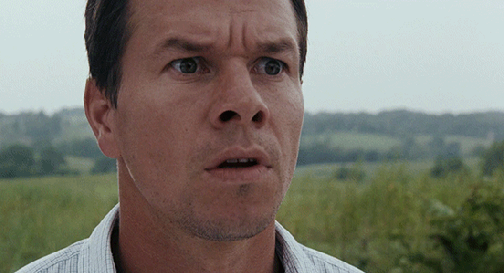

Note:
Don't know how about you, but I've got a lot of questions.

---
<!-- .slide: data-transition="none" -->

@title[Unclear moments]

### Why?!


- Requires storage account
- Requires serialization <!-- .element: class="fragment" -->
- Doesn't allow async calls <!-- .element: class="fragment" -->
- Requires determinism <!-- .element: class="fragment" -->

Note:
- Why does it requires storage account for orchestrator and activity functions? (next bullet)
- Serialization is the simplest one - we can assume that it transfer object between functions that way (next bullet)
- Why it complains about async calls that done without using context?
- Why it complains about non-determenistic code?

We need to learn how durable functions work under the hood

---
<!-- .slide: data-transition="none" -->

@title[How it works. 1]


Note:

Suppose we have our orchestrator function. When it comes to an execution of an activity function

---
<!-- .slide: data-transition="none" -->

@title[How it works. 2]


Note:
It sends a message to a WorkItems queue and after that

---
<!-- .slide: data-transition="none" -->

@title[How it works. 3]


Note:
it's execution stops, it can be unloaded from memory (so you stop paying for it) . At the same time 

---
<!-- .slide: data-transition="none" -->

@title[How it works. 4]


Note:
An activity function listens to the WorkItem queue and once a message appears there,
the activity is got triggered.

---
<!-- .slide: data-transition="none" -->

@title[How it works. 5]


Note:


After it's job is done it sends a message to Control queue

---
<!-- .slide: data-transition="none" -->

@title[How it works. 6]

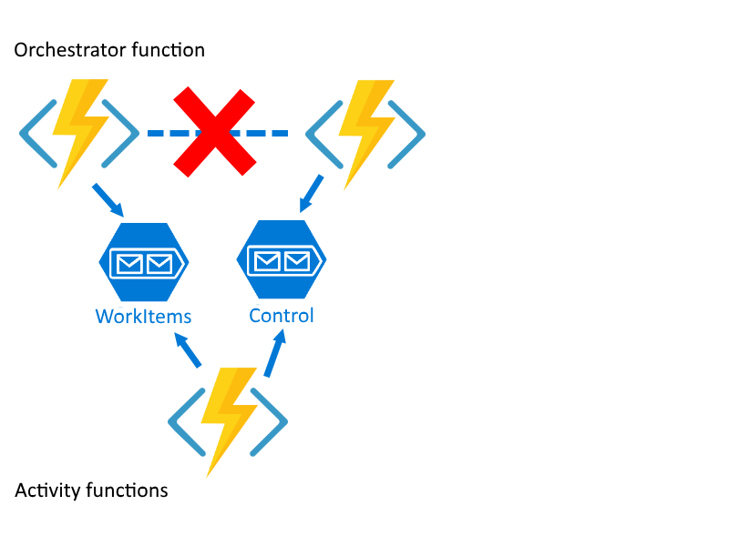

Note:
It triggers an execution of orchestrator function again

---
<!-- .slide: data-transition="none" -->

@title[How it works. 7]


Note:
And after the process is repeated 

---
<!-- .slide: data-transition="none" -->

@title[How it works. 8]


Note:
until the orchestrator function

---
<!-- .slide: data-transition="none" -->

@title[How it works. 9]


Note:
comes to it's end

---
<!-- .slide: data-transition="none" -->

@title[How it works. 10]

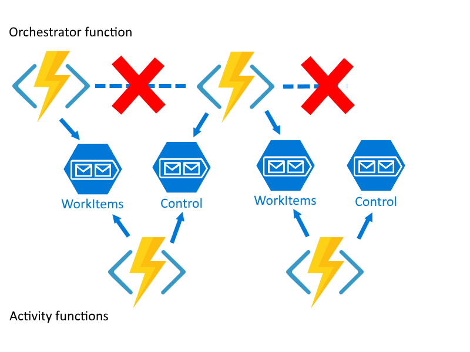

Note:

---
<!-- .slide: data-transition="none" -->

@title[How it works. 11]


Note:
You may ask here - If the orchestrator function stops after calling 
an activity and even is unloaded from the memory

---
@title[Checkpoint replay]

How state is restored?
- Checkpoint/Replay <!-- .element: class="fragment" -->

Note:
how does it restore its state and proceed the execution from the right place? 

For that purpose durable functions use one of the Event Sourcing technique (next bullet)

Chckpoint/Replay

Every time orchestrator function calls an Activity - it's state is checkpointed into a
History table  (next slide)

---
@title[History table]

#### History table


Note:
under your storage account. When Activity function is finished, the history is replayed 
to rebuild the state of the orchestrator function.

Since Orchestrator and Activities may be run on different VMs in some environment that is not 100% reliable,
this approach guaranties reliability - because in a case of a failure the state will be resored and continued.

However this repay process leads to an interesting execution behaviour. Let me show it on an example(next example)

---
<!-- .slide: data-transition="none" -->

@title[Replay. Minions intro]

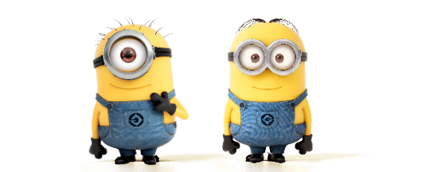

Note:
with the help of this guys. Let them practice in origami and ask them to make a plane in a way how a durable function would do this.

one of the them will be orchestrator and another one activity

---
<!-- .slide: data-transition="none" -->

@title[Replay. Who Orchestrate?]


Note:
Like this

---
<!-- .slide: data-transition="none" -->

@title[Replay. Minions reaction]


Note:
The reaction is strange.

---
<!-- .slide: data-transition="none" -->

@title[Replay. Plan]

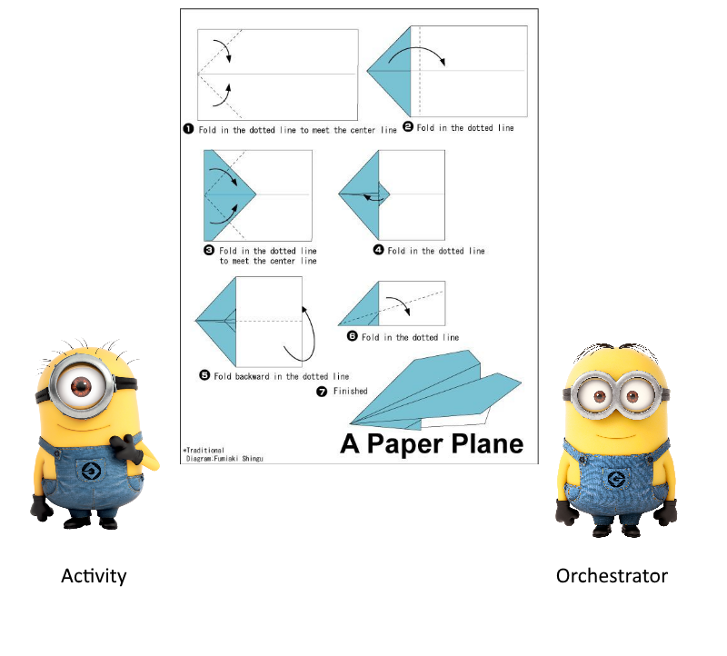

Note:
This instructions are executed by the orchestrator and all the folding operations are done by the activity.

---
<!-- .slide: data-transition="none" -->

@title[Replay. Step 1]


Note:
So, the ochestrator encounters first folding action and it calls an activity
to perform this step.

---
<!-- .slide: data-transition="none" -->

@title[Replay. Step 1. Ok]


Note:
Activity agrees. Orchestrator kind of sleeps. Then activity

---
<!-- .slide: data-transition="none" -->

@title[Replay. Step 1. Done]

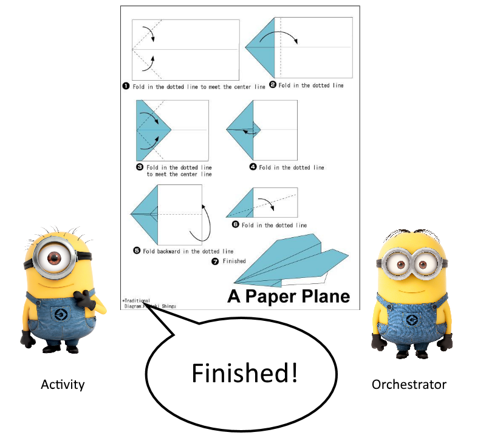

Note:
finishes it's task and returns the results to the orchestrator (via a message in a queue)

Then orchestrator wakes up and replays the history to restore it's state.

---
<!-- .slide: data-transition="none" -->

@title[Replay. Step 1]


Note:
So it looks like it asks an activity to perform the first step again. 

---
<!-- .slide: data-transition="none" -->

@title[Replay. Step 1. Done]

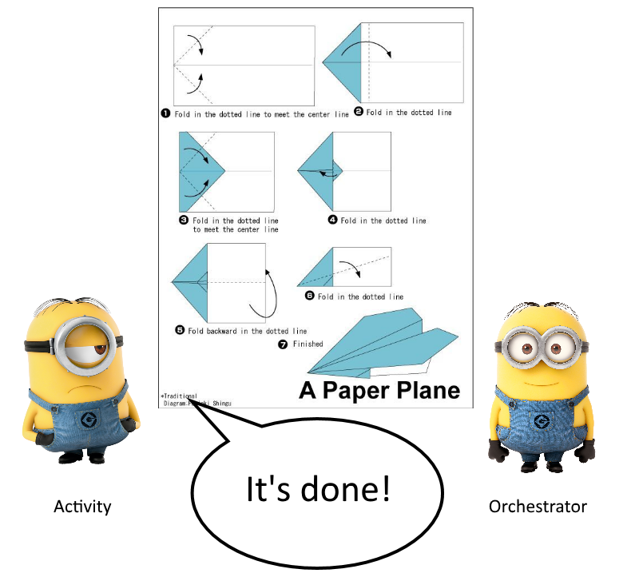

Note:
But since it was already done and results are captured, the activity is 
not called again. The orchestrator moves 

---
<!-- .slide: data-transition="none" -->

@title[Replay. Step 2]

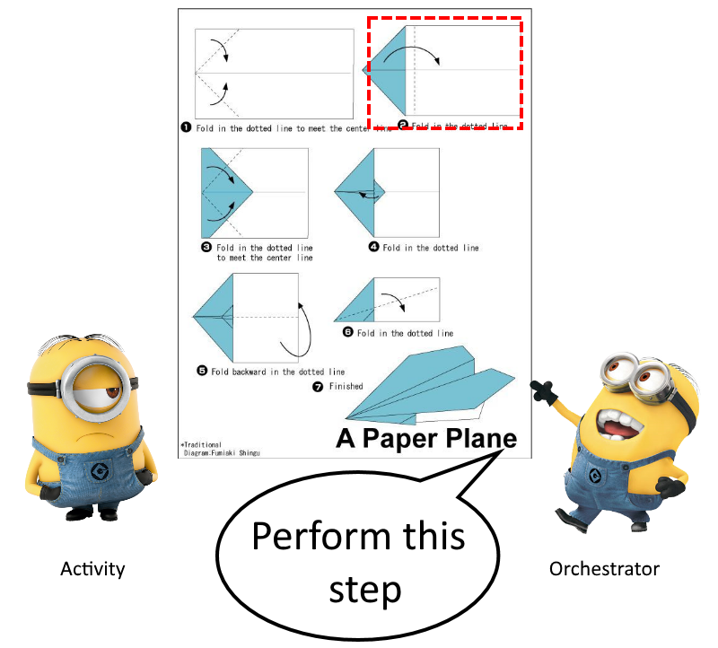

Note:
forward
with the execution and asks the activity to perform the second step.

---
<!-- .slide: data-transition="none" -->

@title[Replay. Step 2. Ok]


Note:
Activity agrees. Orchestrator kind of sleeps. Then activity

---
<!-- .slide: data-transition="none" -->

@title[Replay. Step 2. Done]


Note:
finishes it's task and returns the results to the orchestrator (via a message in a queue)

Then orchestrator wakes up and replays the history to restore it's state.

---
<!-- .slide: data-transition="none" -->

@title[Replay. Step 1]


Note:
So it looks like it asks an activity to perform the first step again. But since it was 
already done and 

---
<!-- .slide: data-transition="none" -->

@title[Replay. Step 1. Done]


Note:
results are captured, the activity is not called again. The orchestrator moves forward
with the execution 

---
<!-- .slide: data-transition="none" -->

@title[Replay. Step 2]


Note:
and asks the activity to perform the second step again. But since it was 
already done and 

---
<!-- .slide: data-transition="none" -->

@title[Replay. Step 2. Done]


Note:
results are captured, the activity is not called again. The orchestrator moves forward
with the execution and asks the activity to perform the third step

---
<!-- .slide: data-transition="none" -->

@title[Replay. Step 3]


Note:

---
<!-- .slide: data-transition="none" -->

@title[Replay. Step 3. Ok]


Note:

---
<!-- .slide: data-transition="none" -->

@title[Replay. Step 3. Done]


Note:

---
<!-- .slide: data-transition="none" -->

@title[Replay. Step 1]


Note:

---
<!-- .slide: data-transition="none" -->

@title[Replay. Step 1. Done]


Note:

---
<!-- .slide: data-transition="none" -->

@title[Replay. Step 2]


Note:

---
<!-- .slide: data-transition="none" -->

@title[Replay. Step 2. Done]


Note:

---
<!-- .slide: data-transition="none" -->

@title[Replay. Step 3]


Note:

---
<!-- .slide: data-transition="none" -->

@title[Replay. Step 3. Done]


Note:
Realizing the fact that the state is always replayed in that way is very important to avoid some stupid performance issues.

If you wonder how can it affect performance, let me convert this example with 6 chained Fold actions into (next slide)

---
@title[Folding code]

```CSharp
for (var i = 0; i< 6; i++)
{
  await ctx.CallActivityAsync("Fold", input);
}
```

How many ctx.CallActivityAsync() calls? <!-- .element: class="fragment" -->

Note:
the following code(next bullet)

What do you think - given that the state is alwas replayed - how many times the method call activity async method will be called?

It is an arithmetic progression (next slide)

---
@title[Number of calls]

((a1 + an) * N) / 2 = ((1 + 6) * 6) / 2 = 21

Note:
TODO: put propper formula

and can be calculated as follows.

---
@title[Amount of calls]

### Calls to Activity
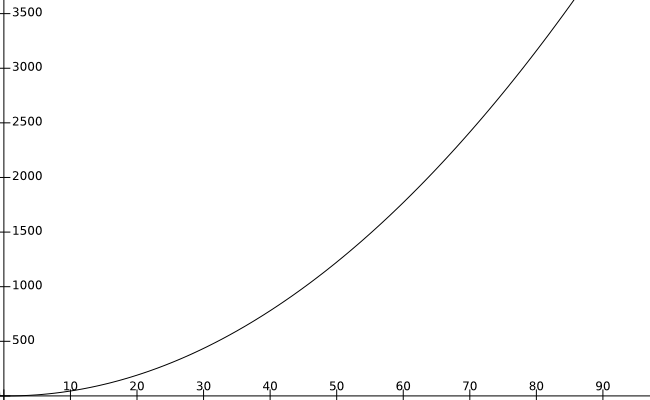

- 7 - 28
- 10 - 55
- 20 - 210
- 100 - 5050

Note:
that means that if we have a loop with 20 iterations -  210

It becomes really noticable when 
---
@title[Heavy code]

```CSharp
for (var i = 0; i< 6; i++)
{
  DoSomethingHeavy();
  await ctx.CallActivityAsync("Fold", input);
}
```

Note:

We have some code in the Orchestrator that is kind of heavy. This code will be executed 21 times while Fold only 6.

---
@title[Heavy code]

```CSharp
for (var i = 0; i< 6; i++)
{
  await ctx.CallActivityAsync("DoSomethingHeavy", null);
  await ctx.CallActivityAsync("Fold", input);
}
```

Note:
Perform all the heavy code within activity functions.

---
@title[Back to code]

Note:
Now we can see that what used to look alright turns out to be completely wrong. 

Basically during the each replay we load different bitmap that is twice smaller in size. Also properly cropped. That makes the code indeed non-determenistic.

Let's reiterate the constrains of the Orchestrator function.

---
@title[Restrictions]

### Constrains

- Determenstic <!-- .element: class="fragment" -->
- No async calls <!-- .element: class="fragment" -->
- No infinite loops <!-- .element: class="fragment" -->

Note:
It will be replayed multiple times and must produce the same result each time. For example, no direct calls to get the current date/time, get random numbers, generate random GUIDs, or call into remote endpoints. (next bullet)

The Durable Task Framework executes orchestrator code on a single thread and cannot interact with any other threads that could be scheduled by other async APIs. (next bullet)

saves execution history as the orchestration function progresses, an infinite loop could cause an orchestrator instance to run out of memory.

---
@title[Inpaint demo]

### Demo

Note:

I have a proper implementation of the inpainting on GitHub. For those who are interested in here is a link.

Let's run it.

---
@title[Recap]

### Recap
- State is checkpointed in Starage Table
- State is replayed multiple times
- No heavy code in Orchestrator
- Orchestrator should be determenistic

