@title[Title]

## Durable Functions
# Complexity behind Simplicity

---
@title[Serverless refresher]

## What is serverless?
- Abstraction of servers
- Event-driven
- Micro-billing
---
@title[Azure functions]


---
<!-- .slide: data-transition="none" -->

@title[What is still hard?]


---
<!-- .slide: data-transition="none" -->

@title[What is still hard?]

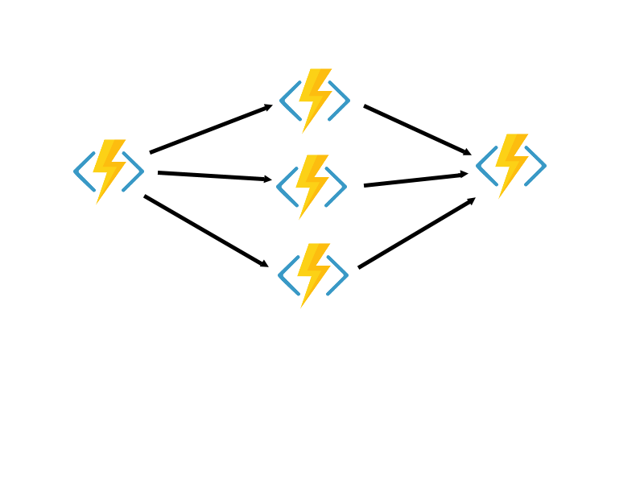


---
<!-- .slide: data-transition="none" -->

@title[What is still hard?]


---
<!-- .slide: data-transition="none" -->

@title[What is still hard?]

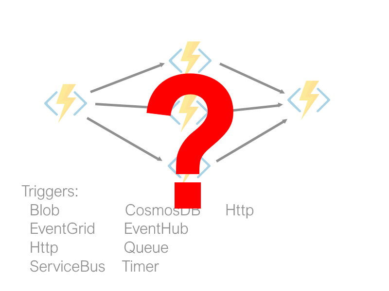

---
@title[Overhead]


---
@title[Durable functions intro]

## Durable Functions
- Simplify orchestration <!-- .element: class="fragment" -->
- Code your workflow  <!-- .element: class="fragment" -->
- 100% reliability  <!-- .element: class="fragment" -->

---
<!-- .slide: data-transition="none" -->

@title[New triggers]

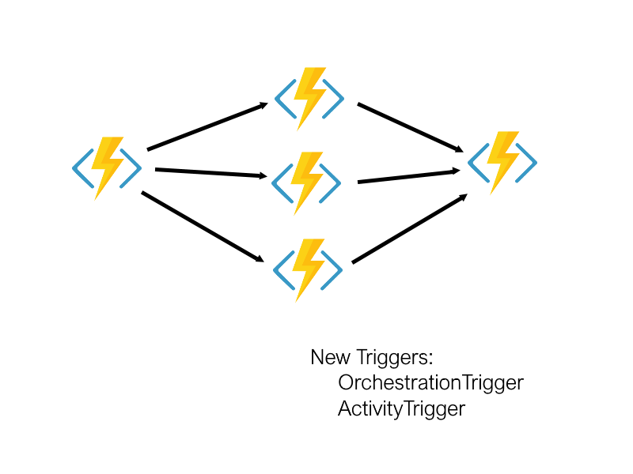


---
<!-- .slide: data-transition="none" -->

@title[New triggers]

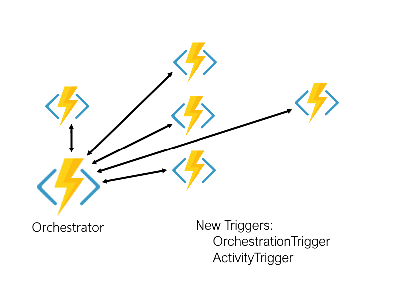


---
@title[Coding. Demonstration of simplicity]

## Demo coding I

---
@title[Easy]

# Easy!


---
@title[Coding. Violating the constraints]

## Demo coding II


---
<!-- .slide: data-transition="none" -->

@title[What?!]

### Why?!


---
<!-- .slide: data-transition="none" -->

@title[Unclear moments]

### Why?!


- Requires storage account
- Requires serialization <!-- .element: class="fragment" -->
- Doesn't allow async calls <!-- .element: class="fragment" -->
- Requires determinism <!-- .element: class="fragment" -->


---
<!-- .slide: data-transition="none" -->

@title[How it works. 1]


---
<!-- .slide: data-transition="none" -->

@title[How it works. 2]


---
<!-- .slide: data-transition="none" -->

@title[How it works. 3]

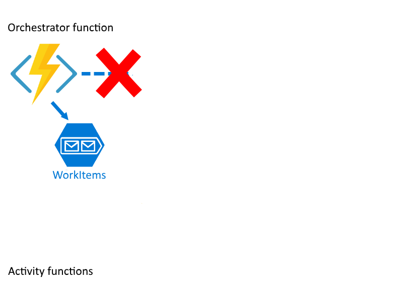

---
<!-- .slide: data-transition="none" -->

@title[How it works. 4]


---
<!-- .slide: data-transition="none" -->

@title[How it works. 5]

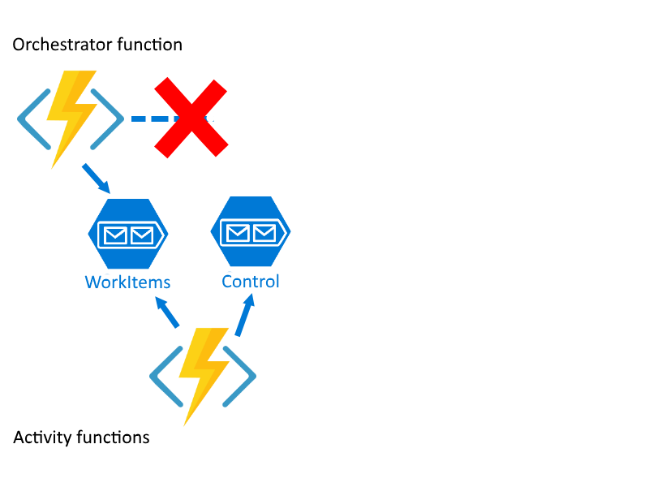

---
<!-- .slide: data-transition="none" -->

@title[How it works. 6]


---
<!-- .slide: data-transition="none" -->

@title[How it works. 7]

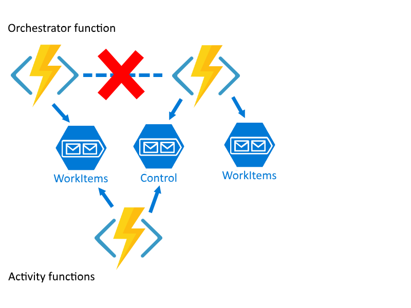

---
<!-- .slide: data-transition="none" -->

@title[How it works. 8]


---
<!-- .slide: data-transition="none" -->

@title[How it works. 9]

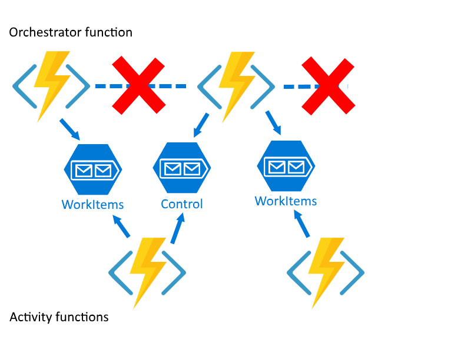

---
<!-- .slide: data-transition="none" -->

@title[How it works. 10]


Note:

---
<!-- .slide: data-transition="none" -->

@title[How it works. 11]

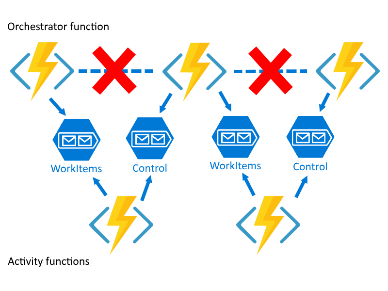


---
@title[Checkpoint replay]

How state is restored?
- Checkpoint/Replay <!-- .element: class="fragment" -->

---
@title[History table]

#### History table


---
<!-- .slide: data-transition="none" -->

@title[Replay. Minions intro]


---
<!-- .slide: data-transition="none" -->

@title[Replay. Who Orchestrate?]

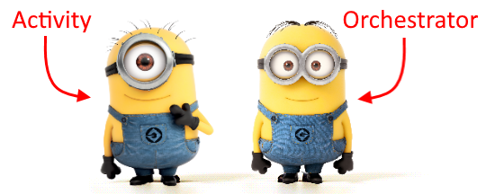


---
<!-- .slide: data-transition="none" -->

@title[Replay. Minions reaction]


---
<!-- .slide: data-transition="none" -->

@title[Replay. Plan]


---
<!-- .slide: data-transition="none" -->

@title[Replay. Step 1]


---
<!-- .slide: data-transition="none" -->

@title[Replay. Step 1. Ok]

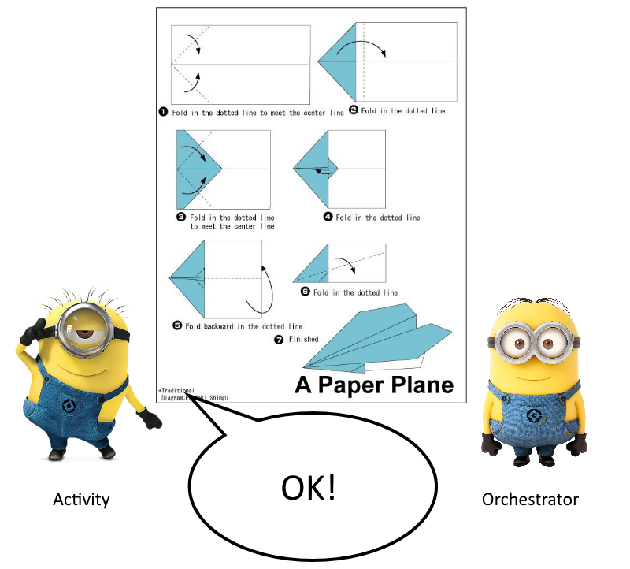


---
<!-- .slide: data-transition="none" -->

@title[Replay. Step 1. Done]


---
<!-- .slide: data-transition="none" -->

@title[Replay. Step 1]

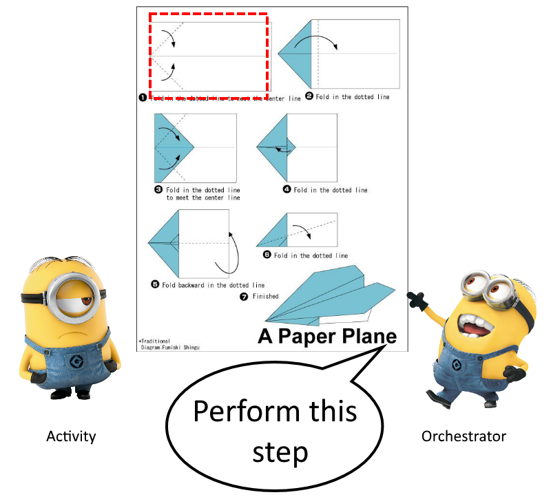

---
<!-- .slide: data-transition="none" -->

@title[Replay. Step 1. Done]


---
<!-- .slide: data-transition="none" -->

@title[Replay. Step 2]


---
<!-- .slide: data-transition="none" -->

@title[Replay. Step 2. Ok]


---
<!-- .slide: data-transition="none" -->

@title[Replay. Step 2. Done]


---
<!-- .slide: data-transition="none" -->

@title[Replay. Step 1]


---
<!-- .slide: data-transition="none" -->

@title[Replay. Step 1. Done]


---
<!-- .slide: data-transition="none" -->

@title[Replay. Step 2]


---
<!-- .slide: data-transition="none" -->

@title[Replay. Step 2. Done]


---
<!-- .slide: data-transition="none" -->

@title[Replay. Step 3]

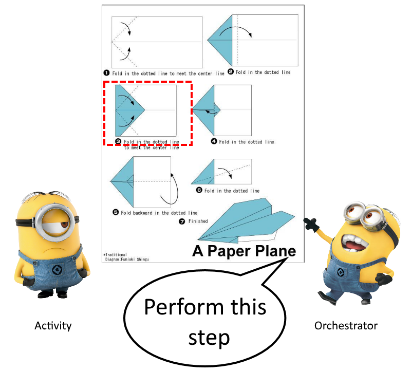

---
<!-- .slide: data-transition="none" -->

@title[Replay. Step 3. Ok]


Note:

---
<!-- .slide: data-transition="none" -->

@title[Replay. Step 3. Done]


Note:

---
<!-- .slide: data-transition="none" -->

@title[Replay. Step 1]


Note:

---
<!-- .slide: data-transition="none" -->

@title[Replay. Step 1. Done]


Note:

---
<!-- .slide: data-transition="none" -->

@title[Replay. Step 2]


Note:

---
<!-- .slide: data-transition="none" -->

@title[Replay. Step 2. Done]


Note:

---
<!-- .slide: data-transition="none" -->

@title[Replay. Step 3]


Note:

---
<!-- .slide: data-transition="none" -->

@title[Replay. Step 3. Done]


---
@title[Folding code]

```CSharp
for (var i = 0; i< 6; i++)
{
  await ctx.CallActivityAsync("Fold", input);
}
```

How many ctx.CallActivityAsync() calls? <!-- .element: class="fragment" -->

---
@title[Number of calls]

((a1 + an) * N) / 2 = ((1 + 6) * 6) / 2 = 21


---
@title[Amount of calls]

### Calls to Activity


- 7 - 28
- 10 - 55
- 20 - 210
- 100 - 5050


---
@title[Heavy code]

```CSharp
for (var i = 0; i< 6; i++)
{
  DoSomethingHeavy();
  await ctx.CallActivityAsync("Fold", input);
}
```


---
@title[Heavy code]

```CSharp
for (var i = 0; i< 6; i++)
{
  await ctx.CallActivityAsync("DoSomethingHeavy", null);
  await ctx.CallActivityAsync("Fold", input);
}
```


---
@title[Back to code]


---
@title[Restrictions]

### Constrains

- Determenstic <!-- .element: class="fragment" -->
- No async calls <!-- .element: class="fragment" -->
- No infinite loops <!-- .element: class="fragment" -->

---
@title[Inpaint demo]

### Demo

---
@title[Recap]

### Recap
- State is checkpointed in Starage Table
- State is replayed multiple times
- No heavy code in Orchestrator
- Orchestrator should be determenistic

